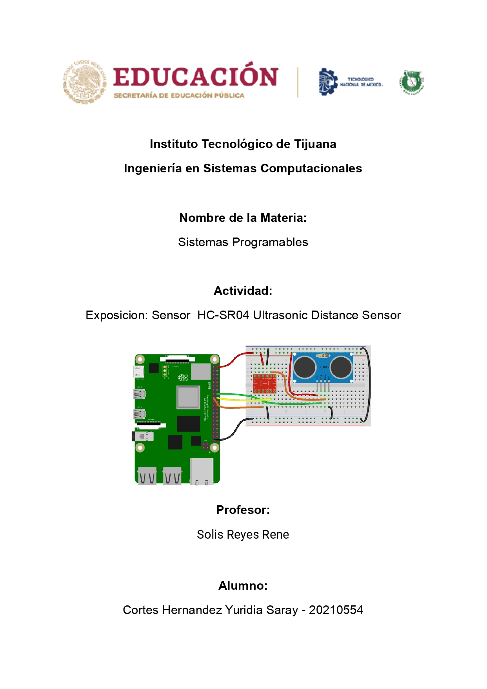
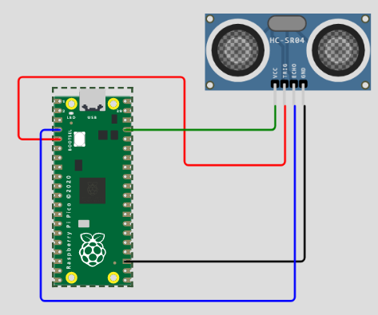

# HC-SR04 Ultrasonic Distance Sensor 💻 


## 👐🏼 ¿Que es? 🙅🏻‍♀️ 
> Sensor de distancias por ultrasonidos capaz de detectar objetos y calcular la distancia a la que se encuentra en un rango de 2 a 450 cm. 


##  👩🏻‍🏫  Caracteristicas ✒️
> Costo: $14 - $60 Pesos.

- Voltaje de Operación: 5V DC
- Corriente de reposo: < 2mA
- Corriente de trabajo: 15mA
- Rango de medición: 2cm a 450cm
- Precisión: +- 3mm
- Ángulo de apertura: 15°
- Frecuencia de ultrasonido: 40KHz
- Duración mínima del pulso de disparo TRIG (nivel TTL): 10 μS
- Duración del pulso ECO de salida (nivel TTL): 100-25000 μS
- Dimensiones: 45*20*15 mm
- Tiempo mínimo de espera entre una medida y el inicio de otra 20ms (recomendable 50ms)
 
##  🌟  Destacado Por  🌟 

- Bajo consumo.
- Gran precisión y bajo precio por lo que esta reemplazando a los sensores polaroid en los robots mas recientes.
- Fácil uso. 
- Programación con las placas de desarrollo.


##   🤷🏻‍♀️ ¿Como Funciona? 👩🏻‍🔧 
> Incorpora un par de transductores de ultrasonido que se utilizan de manera conjunta para determinar la distancia del sensor con un objeto colocado enfrente de este. 
> Un transductor emite una “ráfaga” de ultrasonido y el otro capta el rebote de dicha onda.
El tiempo que tarda la onda sonora en ir y regresar a un objeto puede utilizarse para conocer la distancia que existe entre el origen del sonido y el objeto.


<strong> El Sensor HC-SR04 cuenta con dos transductores ultrasónicos y con 4 terminales de conexión: </strong>

- GND: Alimentación negativa. 
- ECHO: Pin para mandar la señal ultrasónica.
- TRIG: Pin para recibir el rebote de la señal ultrasónica. 
- VCC: Alimentación positiva. 


##  📝 Formula para Calcular la Distancia en la que se Encuentra un Objeto 📏 

 
 ## 🟢 Ventajas  ✅ 
- Pese a esta baja precisión, que impide conocer con precisión la distancia a un objeto, los sensores de ultrasonidos son ampliamente empleados. 
- En robótica es habitual montar uno o varios de estos sensiores, por ejemplo, para detección de obstáculos, determinar la posición del robot, crear mapas de entorno, o resolver laberintos.
 
 
 
 ## 🔴 Desventajas ❌ 

-Los sensores de ultrasonidos son sensores de baja precisión. 
- La orientación de la superficie a medir puede provocar que la onda se refleje, falseando la medición. 
- No resultan adecuados en entornos con gran número de objetos, dado que el sonido rebota en las superficies generando ecos y falsas mediciones. 
- Tampoco son apropiados para el funcionamiento en el exterior y al aire libre.
 
 
 
 ## 🛠️ Aplicaciones 👩🏻‍🔧 
 
- Los sensores ultrasónicos industriales se utilizan principalmente como sensores de proximidad. 
- Se pueden encontrar en estacionamientos automáticos, en los sistemas de seguridad anticolisión de los automóviles. 
- Estos sensores también se utilizan en sistemas robóticos de detección de obstáculos, así como en tecnología para fabricación.
- No son tan susceptibles a la interferencia de humo, gas y otras partículas en el aire. 
- También se utilizan como sensores de nivel para detectar los niveles de líquido en contenedores cerrados (como depósitos en fábricas químicas). 
- La tecnología ultrasónica ha permitido a la industria médica producir imágenes de órganos internos, identificar tumores, etcétera.
 


## 🏁  Link de Woki ⚡

> https://wokwi.com/projects/358610161863645185

## ⚙️ Esquema del Sensor en Uso 📌 



## 🗂️ Codigo Utilizado 📋  

```python
print("Hola Amiwos!")

from machine import Pin 
import utime 

trigger = Pin(3, Pin.OUT) 
echo = Pin(2, Pin.IN) 

def ultra(): 
    trigger.low() 
    utime.sleep_us(2) 
    trigger.high() 
    utime.sleep_us(5) 
    trigger.low() 
    
    while echo.value() == 0: 
        signaloff = utime.ticks_us() 
    while echo.value() == 1: 
        signalon = utime.ticks_us() 

    timepassed = signalon - signaloff 
    distance = (timepassed * 0.0343) / 2 
    print("La Distancia del Objeto es ",distance,"cm") 

while True: 
    ultra() 
    utime.sleep(1)
```


## 🖨️ Paginas Auxiliares 📇 

- https://blog.330ohms.com/2021/12/28/tutorial-8-de-raspberry-pi-pico-sensor-ultrasonico/
- https://blog.330ohms.com/2020/06/17/como-conectar-un-sensor-ultrasonico-a-raspberry-pi/#:~:text=El%20sensor%20HC%2DSR04%20es,con%20uno%20de%20sus%20GPIO
- https://www.murkyrobot.com/guias/sensores/hc-sr04#codigo
- https://www.eneka.com.uy/robotica/sensores/sonido/m%C3%B3dulo-sensor-de-distancias-hc-sr04-detail.html#:~:text=El%20HC%2DSR04%20es%20un,encargada%20de%20hacer%20la%20medici%C3%B3n.
- https://electronicamade.com/sensor-ultrasonico/
- https://www.youtube.com/watch?v=e9WXf-wRTNg

